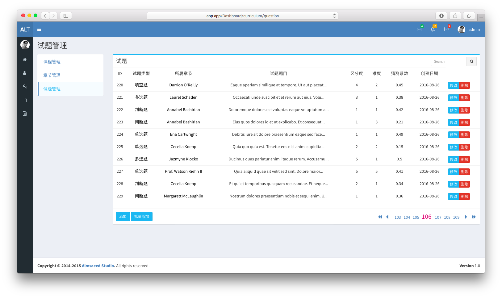

项目著作权为学校所有，未能开源。做个 [Dome](https://exam.dnat.site "Dome")
## 说明
此系统是一个以项目反应原理(又称IRT，Item Response Theory)做为理论依据的考试平台，通过学生能力值选取对应难度考试题生成试卷，最终反映学生真实学习水平，为教师研究教学质量，提高教学水平提供帮助。

#### 安装流程：
环境设置：
`cp .nev.example .env`

生成`key`：
`php artisan key:generate`

安装vender：
`composer install`

Laravel Excel 需要 `PHP`的`zip`扩展，需要自行安装

`sudo apt-get install php7.0-zip`

填充数据:`php artisan migrate --seed`

监听`Queue`：`php artisan queue:listen --queue=examsInfo,firstExamination`

#### Queue监听列表：
1:`examsInfo`

2:`firstExamination`

#### 批量添加：
支持`.csv`、`.xls`、`.xlsx`格式文件
模板在批量添加页面下载

#### 成绩:

分数:`正确 2分 | 半对 1分 | 错误 0分`

考试第二阶段只有全对才能得分

#### 账户：

管理员账户:
`用户名和密码：admin@gmail.com`

教师账户：
`用户名和密码：teacher@gmail.com`

学生账户：
`用户名和密码：student@gmail.com`
