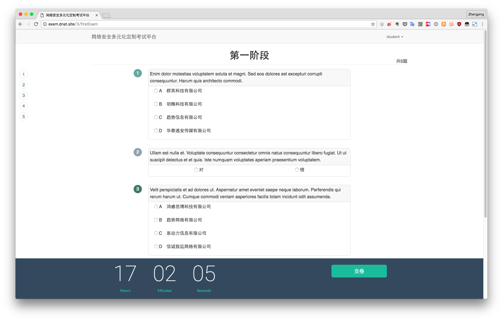

# 说明

项目著作权为学校所有，未能开源。做个 [Dome](https://exam.dnat.site "Dome")

## Dome 账户

管理员账户: `用户名和密码：admin@gmail.com`

教师账户： `用户名和密码：teacher@gmail.com`

学生账户： `用户名和密码：student@gmail.com`

## 系统介绍

此系统是一个以项目反应原理(又称IRT，Item Response Theory)做为理论依据的考试平台，通过学生能力值选取对应难度考试题生成试卷，最终反映学生真实学习水平，为教师研究教学质量，提高教学水平提供帮助。

## 考试流程

系统利用项目反应原理、自然选择策略进行题目挑选和试卷组成。 考试分为两个阶段:第一阶段通过教师选择试卷对应的课程、题目数量 和分数、课程下每个章节及难度系数的题目数量组成最终呈现给考生的 第一阶段试卷。系统根据考生答完的第一阶段试题成绩,挑选合适的题 目作为第二阶段试卷并根据考生每次 交的成绩修改下一轮的试题组 成,直到考试结束。

## 实现功能

用户管理、角色权限管理、课程信息管理、题库管理、在线考试、自动组卷、自动判卷、IP 限制、成绩查询等。

## 使用技术

- 框架：`Laravel` `Vue` `Bootstrap` `Jquery`
- 语言：`Php` `JavaScript` `Html` `Css`
- 编译：`Webpack` `gulp`
- 数据库：`Mysql`
- 缓存：`Redis`

## 截图

  

## 安装流程：

环境设置： `cp .nev.example .env`

生成 `key` ： `php artisan key:generate`

修改 `.env` 环境配置文件中 `Database` 和 `Redis` 相关设置

安装 `vender` ： `composer install`

`Laravel Excel` 需要 `PHP` 的 `zip` 扩展，需要自行安装

`sudo apt-get install php7.0-zip`

监听`Queue`：`php artisan queue:listen --queue=examsInfo,firstExamination`

填充数据:`php artisan migrate --seed`

## Queue监听列表：

1:`examsInfo`

2:`firstExamination`

## 批量添加：

支持 `.csv` `.xls` `.xlsx` 格式文件 模板在批量添加页面下载

## 成绩计算:

分数:`正确 2分` `半对 1分` `错误 0分`

考试第二阶段只有全对才能得分

第一阶段成绩：考生分值 / 第一阶段总分 x 100

第二阶段成绩：考生答对题目难度系数和 / 平均出题难度系数和 x 100

最终成绩：第一阶段分值 / 总分 x 第一阶段得分 + 第二阶段分值 / 总分 x 第二阶段得分

# 自行编译

安装环境 `npm install`

编译 `gulp`
